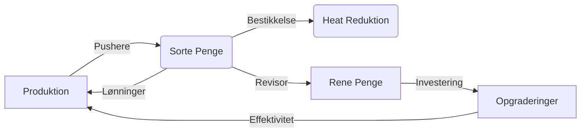

# SYNDICATE OS: KØBENHAVN UNDERVERDEN

> *"I denne by er der to slags mennesker: Dem der har magten, og dem der betaler beskyttelsespenge. Hvem er du?"* - **Sultanen**

 

---

## 🕵️‍♂️ VELKOMMEN TIL GADEN

**Syndicate OS** er en mørk, satirisk Idle Tycoon simulator sat i Københavns kriminelle underverden. Du starter som en simpel løbe-dreng på Vestegnen med et gram hash i lommen og en drøm om at eje hele byen fra Nørrebro til Hellerup.

Dette er ikke et spil om point. Det er et spil om **logistik, hvidvaskning og territorie-krig**.

---

## � V1.0.2: THE "WAR ROOM" UPDATE

Den nyeste opdatering introducerer **UNDERVERDENEN** - en helt ny tab dedikeret til konflikt og overlevelse.

### 💀 NYT: Underverdenen (Tab 4)
*   **Politirapport**: Følg dit **Heat** i realtid. Bliver gaden for varm?
*   **Bestikkelse**: Betal betjente med Sorte Penge for at "glemme" beviserne.
*   **Rivaler**: Saboter dine fjenders operationer eller plyndr deres lagre.
*   **Forsvar**: Byg Bunkers, ansæt Vagter og installer Kameraer for at beskytte dit hovedkvarter.

### 💸 NYT: Finans Overhaul
*   **Hvidvask**: Vælg din risiko! Vask 25%, 50% eller Alt på én gang.
*   **Låne-hajer**: Optag lån på op til 100.000 kr.
*   **Sorte Afdrag**: Betal din gæld af med sorte penge (+50% strafgebyr).

---

## 👑 SPILGUIDE: FRA GADEPLAN TIL KINGPIN

### 1. PRODUKTIONEN (Laboratoriet)
Her skabes varen. Du starter småt, men ender stort.
*   **Tier 1**: Hash & Skunk (Dyrkes af Gartnere).
*   **Tier 2**: Speed & MDMA (Koges af Kemikere).
*   **Tier 3**: Coke & Benzos (Importeres via Havnen).
*   **Tier 4**: Fentanyl (Dødsensfarligt, ekstrem profit).

> **Tip**: Hold øje med lagerpladsen! Hvis lageret er fuldt, stopper produktionen.

### 2. SALGET (Gaden)
Varerne skal ud til kunderne.
*   **Pushere**: Sælger dine varer automatisk.
*   **Distributører**: Flytter større mængder.
*   **Heat**: Hvert salg øger risikoen for politirazzia.
*   **Panic Switch**: Brug den store **Røde Knap** til at stoppe alt salg øjeblikkeligt, hvis politiet kommer for tæt på!

### 3. ØKONOMIEN (Cashflow)
Spillet opererer med to valutaer:
1.  **Sorte Penge**: Tjent på gaden. Kan bruges til løn, råvarer og bestikkelse.
2.  **Rene Penge**: Hvidvasket gennem dine front-butikker. Bruges til **Opgraderinger**, **Ejendomme** og **Crypto**.



---

## 🌍 TERRITORIER & STRATEGI

Overtag Københavns bydele for at få passive bonusser:
*   **Nørrebro**: Giver adgang til billig arbejdskraft.
*   **Christiania**: Øger salgsprisen på Hash/Skunk.
*   **City**: Giver adgang til finansielle markeder.
*   **Hellerup**: Det ultimative mål.

### Crypto Markedet
Brug dine hvide penge på **Bitcoin**, **Ethereum** eller **Monero**. Markedet svinger voldsomt baseret på nyheder. Har du is i maven til at HODL?

---

## �️ TEKNISK INFO

Dette projekt er bygget som en moderne Web App (PWA).
*   **Framework**: React 19 + Vite.
*   **Styling**: TailwindCSS (Custom "Dark Mode" Theme).
*   **State**: React Context API + LocalStorage Persistence.
*   **Deployment**: GitHub Pages.

### Installation (Lokal Udvikling)
```bash
# 1. Klon repoet
git clone https://github.com/KanishDK/Syndicate-os.git

# 2. Installer dependencies
npm install

# 3. Start serveren
npm run dev
```

---

> *"Penge sover aldrig. Det gør politiet heller ikke."*

*(c) 2026 Syndicate OS Development Team*
