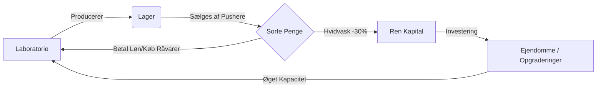

# SYNDICATE OS : Danish Underworld Idle Tycoon

> *"Nogle spil handler om point. Dette handler om magt. Og i København er magt ikke noget man får. Det er noget man tager."*

---

## 🕵️‍♂️ INDLEDNING: THE SYNDICATE ARCHIVES
**Fra: Development Team Alpha**
**Til: Offentligheden (Lækket)**

Velkommen til **Syndicate OS v1.0.0**. Dette er ikke bare et spil. Det er en hyper-realistisk simulation af den københavnske underverden, bygget på data lækket fra krypterede EncroChat-logs og politirapporter.

Vi har samlet et usandsynligt hold for at dokumentere sandheden:
1.  **Dev Teamet**: Kodede simulationen.
2.  **Mads "Muldvarpen" Hansen**: Graver-journalist, der har fulgt pengesporet.
3.  **"Store A"**: Tidligere Kingpin, nu 'konsulent', der fortæller hvordan gaden *rigtigt* fungerer.

---

## 🏙️ HISTORIEN: KØBENHAVN UNDER OVERFLADEN
***Af Mads Hansen, Undersøgende Journalist***

Du tror måske, du kender København. Du ser Café Lattes på Østerbro og ladcykler på Nørrebro. Men under asfalten flyder en anden strøm. En strøm af sorte penge, hvidvaskede gennem pizzeriaer og kiosker. En strøm af varer – fra den milde hash på Staden til den tunge sne i Hellerup.

I **Syndicate OS** starter du ikke som en helt. Du starter som en ingen. En simpel "Gade Soldat" med 2.500 kr. på lommen og en drøm om at blive byens nye **Sultan**.

Din opgave er simpel: Byg et imperium uden at blive knaldet af "Osten" (Politiet) eller dræbt af rivalerne.

---

## 👑 GAMEPLAY: SÅDAN OVERTAGER DU BYEN
***Af "Store A", Ex-Kingpin***

*"Hør her, knægt. Læg telefonen væk og lyt. Gaden har regler, og hvis du ikke kender dem, ender du i Vestre Fængsel eller på Vestegnen i en plastikpose."*

### 1. PRODUKTIONEN (Varen)
Du kan ikke sælge luft. Du skal bruge varer.
*   **Tier 1 (Gadeplan)**: Hash (Lys/Mørk) og Piller. De lave hængende frugter. Junkies og Pushere er din start.
*   **Tier 2 (Klubben)**: Speed, MDMA, Keta. Nu snakker vi natteliv. Her skal du bruge Kemikere.
*   **Tier 3 (High Rollers)**: Coke, Svampe, Benzos. De rige betaler godt, men de kræver kvalitet. Smuglere er nødvendige.
*   **Tier 4 (Kartellet)**: Oxy, Heroin, Fentanyl. Dødsensfarligt. Kæmpe profit, kæmpe risiko.

### 2. CREWET (Dine Folk)
Du er kun så stærk som dit hold.
*   **Junkies ("Zombier")**: Arbejder gratis for et fix. De dør hele tiden. Start med dem, men skift dem ud.
*   **Gartnere & Kemikere**: Professionelle. De skal have løn, og de strejker hvis du glemmer det.
*   **Pushere**: Sælger småt på hjørnet.
*   **Distributører**: Kører varen ud i varevogne.
*   **Bagmænd**: Mødes med folk i jakkesæt. Flytter kilo, ikke gram.
*   **Revisoren**: Din bedste ven. Vasker dine sorte penge hvide automatisk.
*   **Advokaten**: Holder varmen nede. Dyr i drift, men billigere end en razzia.

### 3. ØKONOMIEN (Sorte vs. Hvide Penge)
*"Penge er ikke bare penge. Der er 'Lapper' (Sorte) og 'Likvide' (Hvide)."*
*   **Sort Cash**: Det du tjener på gaden. Kan bruges til at købe varer og betale sorte lønninger. Kan *ikke* bruges på lovlige investeringer (Opgraderinger).
*   **Hvid Cash**: Det du har vasket. Bruges til at købe Ejendomme, Opgraderinger og Crypto.
*   **Hvidvaskning**: Du taber ca. 30% til "gebyrer" (Revisoren skal også leve). Men hellere 70% hvide end 100% beslaglagte.

---

## 🚔 HEAT & RISIKO
***Politirapport, Sagsnummer #2910-KBH***

*   **Heat Meteret**: Hver gang du sælger, stiger varmen.
*   **Konsekvenser**:
    *   **>50%**: Politiet begynder at patruljere oftere.
    *   **>80%**: Du risikerer Razziaer. De tager dine penge og dine varer.
    *   **100%**: Game Over? Nej, men det gør ondt. Afkøl varmen ved at stoppe salget eller betal din Advokat.

---

## 📈 FEATURES & FEATURES
***Dev Team Alpha - Technical Breakdown***

### 🌍 TERRITORIER
Erobring af Københavns bydele låser op for passive indtægter og nye markeder.
1.  **Staden**: Giver adgang til det "fri marked".
2.  **Halmtorvet**: Vesterbros hjerte.
3.  **Hellerup**: Endgame. Her bor pengene.

### ₿ CRYPTO EXCHANGE
En indbygget markeds-simulator. Køb Bitcoin, Ethereum eller Monero for dine hvide penge.
*   **Volatilitet**: Markedet crasher og pumper baseret på "Virkelige" nyheder i spillet.
*   **Strategi**: "Buy low, sell high" eller HODL til døden.

### ⚔️ BOSS BATTLES
Hver 5. level møder du en rival.
*   **Boss Mechanics**: Turbaseret kamp. Din "Attack" afhænger af dine våben (Upgrade 'Vagtværn'), din "Defense" af din Bunker.

### 🔄 PRESTIGE SYSTEM (Reset)
Når du har klaret spillet (Level 30+ / Alle Missioner), kan du lave et **Prestige Reset**.
*   Du mister alt (Penge, Varer, Ansatte).
*   Du beholder: **Respekt**.
*   **Prestige Multiplier**: Giver permanent bonus til al indtægt i næste gennemspilning.

---

## 📚 SYNDICATE ECONOMICS (Whitepaper)
***Classified: Internal Memo***

Dette afsnit beskriver de matematiske modeller bag spillets økonomi.

### 1. THE FLOW OF MONEY (Cashflow Loop)
Pengestrømmen in Syndicate OS er cirkulær, men med "lækage" (Heat og Hvidvask).

### 2. COST SCALING (Inflation)
Prisen på ansatte og upgrades stiger **Geometrisk**. Dette forhindrer uendelig eksponentiel vækst uden strategi.
Formlen for prisen på næste enhed:
$$ Pris_{n} = Base \times GrowthFactor^{n} $$

**Eksempel (Junkie - Factor 1.5x):**
*   Junkie #1: 1.000 kr.
*   Junkie #2: 1.500 kr.
*   Junkie #5: 5.062 kr.
*   Junkie #10: 38.443 kr.

**Hvad betyder det for dig?**
I starten kan du købe alt. I endgame skal du vælge: Skal du have *én* super-dyr Kemiker eller 100 billige Junkies? (Hint: Kvalitet slår kvantitet pga. lagerplads).

### 3. CRYPTO VOLATILITY MODEL
Krypto-markedet i spillet simulerer virkelighedens volatilitet ved hjælp af en **Random Walk** model.

*   **Bitcoin (BTC)**: Lav Varians (±5%). "Sikker" havn.
*   **Ethereum (ETH)**: Medium Varians (±8%).
*   **Monero (XMR)**: Høj Varians (±12%). High Risk, High Reward.

**Markeds-Cyklusser:**
Markedet skifter mellem "Bull" (Op) og "Bear" (Ned) baseret på nyheds-events.
> *Tip: Køb når nyhederne er dårlige (Røde). Sælg når nyhederne er gode (Grønne).*

### 4. PROFIT MARGINS (ROI)
Hvor tjener man mest? Her er dækningsbidraget pr. solgt enhed (uden lønninger):

| Vare | Base Cost | Salgspris | Profit % | Risiko (Heat) |
| :--- | :--- | :--- | :--- | :--- |
| **Hash (Lys)** | 15 kr | 35 kr | 133% | Lav |
| **Speed** | 750 kr | 1.500 kr | 100% | Mellem |
| **Coke** | 15.000 kr | 32.500 kr | 116% | Høj |
| **Fentanyl** | 180.000 kr | 375.000 kr | 108% | Ekstrem |

| **Fentanyl** | 180.000 kr | 375.000 kr | 108% | Ekstrem |

*Note: Selvom %-profit er lavere på Tier 4, er den absolutte profit pr. klik tusindvis af gange højere.*

### 5. SALARY MECHANICS (Lønningsdag)
Dine ansatte skal have løn hvert minut. Systemet er automatisk, men brutalt:

1.  **Prioritet 1 (Hvide Penge)**: Hvis du har råd, betales lønnen herfra. **Ingen straf.**
2.  **Prioritet 2 (Sorte Penge)**: Hvis du mangler hvide penge, bruges sorte penge. **Straf: +50% Omkostning** (Risikotillæg).
3.  **Prioritet 3 (Strejke)**: Hvis kassen er tom? **Produktionen stopper.**

> *Strategi: Sørg altid for at have hvidvasket nok til næste lønning. Det er dyrt at være fattig.*

---

## 💡 STRATEGI GUIDE
***Tips fra fællesskabet***

### 🐰 THE SPEEDRUNNER (Hurtigst til Level 10)
1.  **Junkie Spam**: Køb 10 Junkies med det samme. De producerer hurtigt og er gratis.
2.  **Manuelt Salg**: Klik som en gal i starten. Vent ikke på auto-sell.
3.  **Hop over Hvidvask**: Brug sorte penge på at købe mere råstof. Vask kun det absolut nødvendige til opgraderinger.
4.  **Ignorer Heat**: Lev farligt. Hvis du bliver raidet, så start forfra.

### ☕ THE CASUAL (Sikker Vækst)
1.  **Automation**: Få hurtigt en Pusher og en Revisor.
2.  **Low Heat**: Hold altid Heat under 50%. Stop salget hvis det bliver varmt.
3.  **Crypto Opsparing**: Læg overskuddet i Bitcoin. Det vokser mens du sover (hvis du ikke crasher).
4.  **Opgrader Lageret**: Du vil ikke miste produktion fordi lageret er fuldt.

### 🏆 THE 100% TYCOON (Completionist)
1.  **Maximer Alt**: Køb alle upgrades, også dem du ikke "behøver".
2.  **Monopol**: Overtag alle territorier før du rykker videre til næste Tier.
3.  **Hoarder**: Fyld lageret med 1000 af hver vare for at være klar til store Missioner.
4.  **Prestige**: Spillet starter først rigtigt efter 3. reset.

## 🏆 ACHIEVEMENTS & PRESTIGE (Endgame)
***Hall of Fame***

Når du har nået toppen, er der kun én vej: **Exit Scam**.
### Prestige Reset
*   **Krav**: Level 10+
*   **Effekt**: Nulstiller Cash, Lager, Bygninger.
*   **Belønning**: **Prestige Multiplier** (Geometrisk skalering: Det går hurtigere hver gang).
*   **Nye Features**: Låser op for "Sorte Marked" perks (Hvidvask hastighed, Heat reduktion etc.)

### Hall of Fame
Saml trophies for at bevise dit værd:
*   **Diamond Hands**: Ejer 10+ Bitcoin.
*   **Escobar**: Producer 1.000 kg Coke.
*   **Urørlig**: 0% Heat med 1 mio. sorte penge.

---

## 🎮 KONTROL & GENVEJE

Spillet er designet til hurtig navigation. Brug tastaturet som en pro.

| Tast | Funktion |
| :--- | :--- |
| **1-6** | Skift Tab (Produktion, Gaden, Finans...) |
| **Shift + Click** | Køb 10x (På knapper der støtter det) |
| **Ctrl + Click** | Køb Max (På knapper der støtter det) |
| **Space** | Pause/Resume Produktion |
| **Esc** | Luk Modals |

---

## 🛠️ TEKNISK INFO
**Version**: 1.0.1 (Gold Master)
**Stack**: React 19, Vite, TailwindCSS.
**Save System**: LocalStorage (Gemmer automatisk hvert 30. sek).

> *"Velkommen til Gaden. Husk: Tillid er godt, men kontrol er bedre."*
> - **Sultanen**
